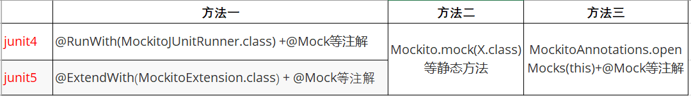

<h3 style="color:red;text-align:center">乐之者java: http://www.roadjava.com 制作</h3>

<h1 style="color:orange;text-align:center">mockito+junit搞定单元测试</h1>

### 一、简介

#### 1.1 单元测试的特点

* 配合断言使用(杜绝System.out)
* 可重复执行
* 不依赖环境
* 不会对数据产生影响
* spring的上下文环境不是必须的
* 一般都需要配合mock类框架来实现

#### 1.2 mock类框架使用场景

要进行测试的方法存在外部依赖(如db,redis,第三方接口调用等),为了能够专注于对该方法(单元)的逻辑进行测试,就希望能==虚拟出外部依赖==,避免外部依赖成为测试的阻塞项。一般单元测试都是针对service层。

#### 1.3 常用mock类框架

> mock类框架: 用于mock外部依赖

#####1.3.1 mockito

名称: ito: input to output

官网: https://site.mockito.org

官网文档:https://javadoc.io/doc/org.mockito/mockito-core/latest/org/mockito/Mockito.html

限制: 老版本对于final class、final method、static method、private method均不能被mockito mock, 目前已支持final class、final method、static method的mock，具体可以参考官网

原理: bytebuddy ,教程: https://www.bilibili.com/video/BV1G24y1a7bd

#####1.3.2 easymock

##### 1.3.3 powermock

官网: https://github.com/powermock/powermock

与mockito的版本支持关系: https://gitee.com/mirrors/powermock/wikis/Mockito#supported-versions

对mockito或easymock的增强

#####1.3.4 JMockit

### 二、mockito的单独使用

#### 2.1 mock对象与spy对象

|          | 方法插桩     | 方法不插桩           | 作用对象     | 最佳实践         |
| -------- | ------------ | -------------------- | ------------ | ---------------- |
| mock对象 | 执行插桩逻辑 | 返回mock对象的默认值 | 类、接口     | 被测试类或其依赖 |
| spy对象  | 执行插桩逻辑 | 调用真实方法         | ==类==、接口 | 被测试类         |

#### 2.2 初始化mock/spy对象的方式

#### 2.3 参数匹配

#### 2.4 方法插桩

> 指定调用某个方法时的行为(stubbing),达到相互隔离的目的

* 返回指定值
* void返回值方法插桩
* 插桩的两种方式
  * when(obj.someMethod()).thenXxx():其中obj可以是mock对象
  * doXxx().when(obj).someMethod():其中obj可以是mock/spy对象或对无返回值的方法进行插桩
* 抛异常
* 多次插桩
* thenAnswer
* 执行真正的原始方法
* verify的使用

####2.5 @InjectMocks注解的使用

* 作用: 若@InjectMocks声明的变量需要用到mock/spy对象，mockito会自动使用当前类里的mock或spy成员进行按类型或

  名字的注入

* 原理: 构造器注入、setter注入、字段反射注入

#### 2.6 断言工具

hamcrest:junit4中引入的第三方断言库,junit5中被移出,从1.3版本后,坐标由org.hamcrest:hamcrest-core变为

​				  org.hamcrest:hamcrest,用的少

assertJ:常用的断言库

junit4原生断言

junit5原生断言

###三、实战讲解

###四、mockito在springboot环境使用(不推荐)

> 生成的对象受spring管理

@MockBean

* 类似@Mock
* 用于通过类型或名字==替换==spring容器中已经存在的bean,从而达到对这些bean进行mock的目的

@SpyBean

* 作用类似@Spy
* 用于通过类型或名字==包装==spring容器中已经存在的bean,当需要mock被测试类的某些方法时可以使用